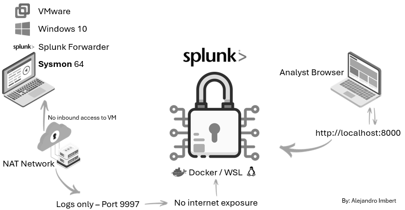

## Security Principles & Lab Isolation Model

- All offensive activity (malware execution, exploitation, adversary simulation) is performed exclusively inside isolated virtual machines.

- The Windows VM is network-isolated using NAT, preventing inbound connections from external networks.

- The Splunk Enterprise instance runs inside Docker containers with no direct internet exposure.

- Communication between systems is unidirectional:

    - Endpoints → Splunk (log forwarding only)

    - No command or control traffic originates from Splunk.

- Log collection is performed using Splunk Universal Forwarder, minimizing attack surface on the endpoint.

- Telemetry is collected via Sysmon, ensuring high-fidelity security events without relying on external agents.

This architecture emulates a real SOC lab environment, prioritizing containment, visibility, and forensic integrity.

### Project Architecture

This lab simulates a real-world SOC detection pipeline with isolated endpoints and centralized log analysis

