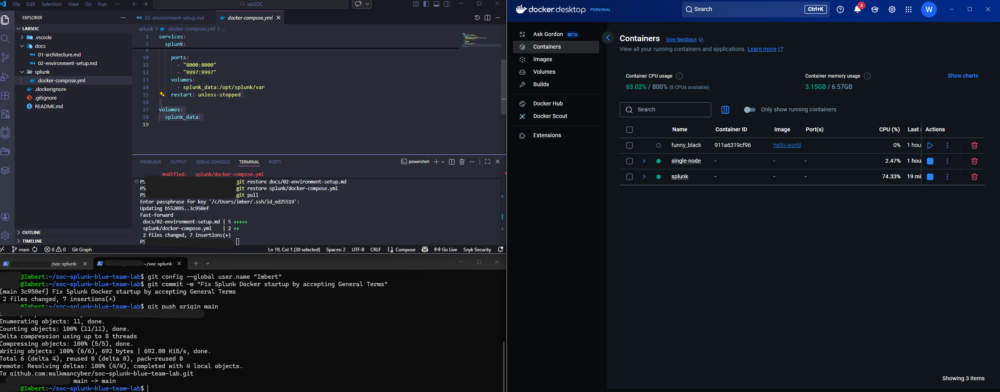
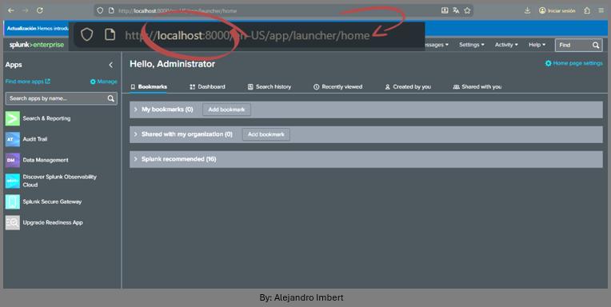

### Splunk Startup Verification

Splunk was started using Docker Compose and verified by:
- Checking running containers with `docker ps`
- Reviewing startup logs via `docker logs`
- Accessing the web interface at http://localhost:8000

### Configuration 

This image shows the initial setup of the lab environment, including the WSL Linux terminal, Visual Studio Code with the docker-compose.yml file, and Docker Desktop confirming that the Splunk container is running successfully.

### Splunk Web interface

This image shows the Splunk Web interface after a successful login, accessed via http://localhost:8000, displaying the main Splunk dashboard for the first time.

