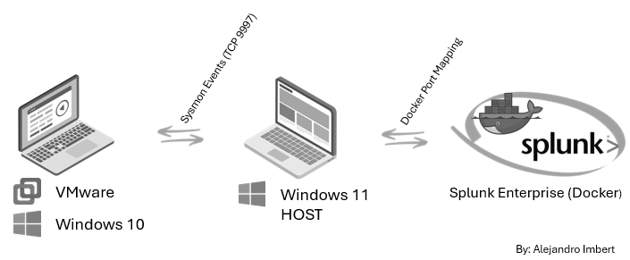
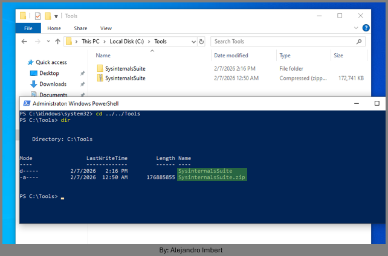
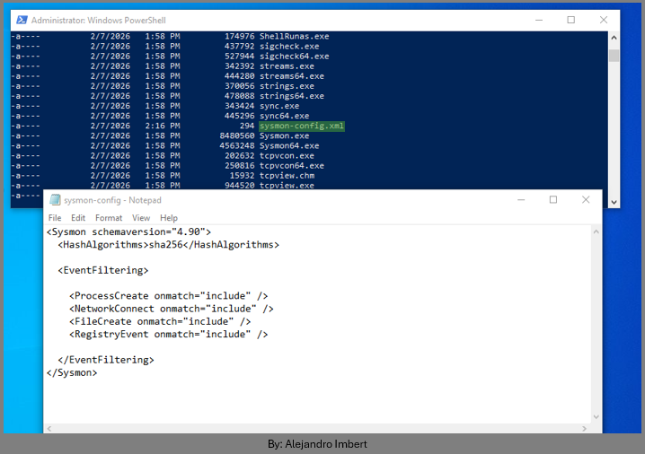
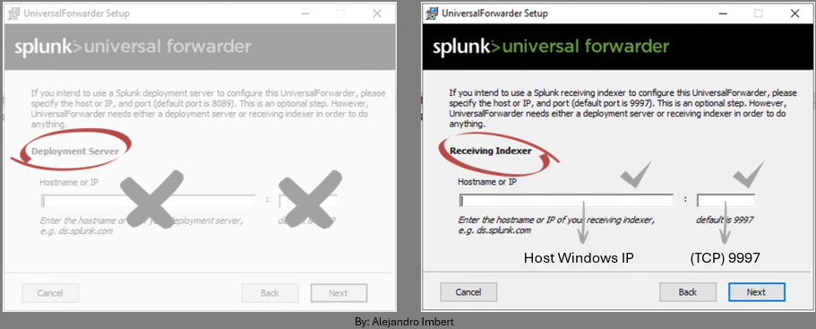
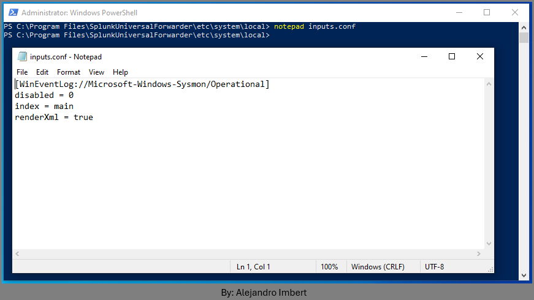
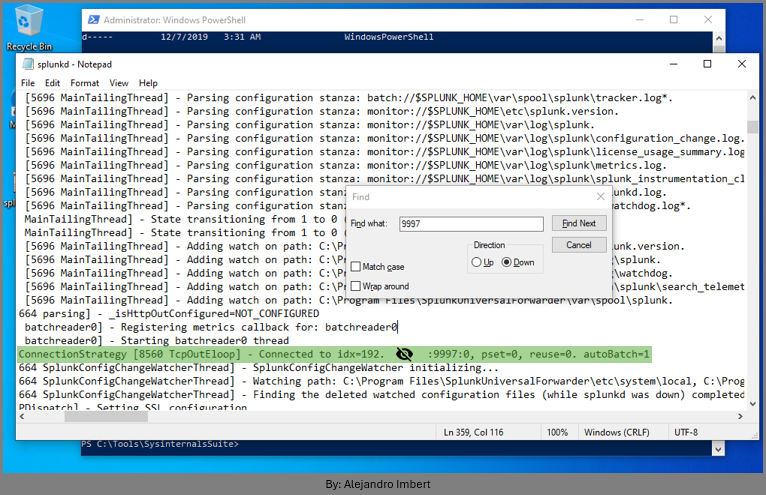
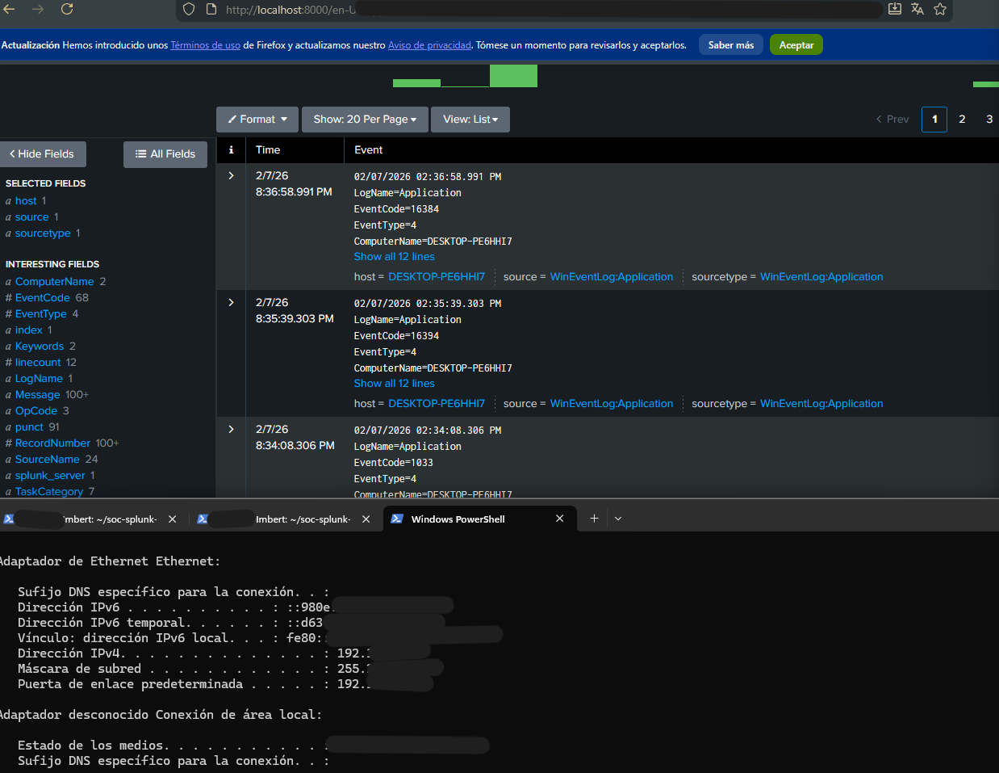

# Splunk Universal Forwarder Installation (Windows Endpoint)

### Objective

Install and configure Splunk Universal Forwarder on a Windows (VMware) endpoint to securely forward Sysmon telemetry to Splunk Enterprise running inside Docker on the host machine.

### Architecture Overview

The Windows endpoint sends Sysmon events to Splunk Enterprise through the Universal Forwarder.

This lab simulates a real-world SOC detection pipeline with isolated endpoints and centralized log analysis.



- The endpoint does NOT communicate with Docker directly.
- Docker exposes port `9997` on the host.
- The forwarder sends data to the `host IP`.

### Security Considerations

- NAT network prevents direct internet exposure.
- Port `9997` is only accessible inside the local lab.
- No deployment server is used.
- No malware executed at this stage.

### Prerequisites

Before installing the forwarder, the following must be completed:

- Splunk Enterprise running in Docker
- Port `9997` exposed and listening
- Sysmon installed and generating events
- Host Windows IP address identified

## Sysmon  

### Step A – Download Sysmon

On the *Windows VM*:

- Download Sysmon from Microsoft Sysinternals.

- Extract `.zip`



### Step B – Sysmon Configuration

- Create a Sysmon configuration file.

For this lab, a community-based configuration was used as a baseline (SwiftOnSecurity-style).
Example filename:

`sysmon-config.xml`

*Place the file in the same directory as* `Sysmon64.exe`

- Crate a `notepad sysmon-config.xml` and copy:

```
<Sysmon schemaversion="4.90">
 <HashAlgorithms>sha256</HashAlgorithms>
 
  <EventFiltering>
   <ProcessCreate onmatch="include" />
   <NetworkConnect onmatch="include" />
   <FileCreate onmatch="include" />
   <RegistryEvent onmatch="include" />

 </EventFiltering>
</Sysmon>
```



### Step C – Install Sysmon with XML Configuration

- In PowerShell as Administrator navigate to the Sysmon directory.
- Install Sysmon using the configuration file:

`.\Sysmon64.exe -accepteula -i sysmon-config.xml`

*Expected output indicates successful installation.*

### XML Configuration Is Required

By default, Sysmon does not generate useful telemetry.
The XML configuration allows:

- Control over which events are logged
- Reduction of noise
- Alignment with Blue Team detection use cases

*Without the XML file, Splunk would receive little to no valuable endpoint data.*

## Security Notes

- Only Sysmon telemetry is collected.
- No malware execution required.
- Events are generated using benign system activity.

## VMware Windows Splunk Universal Forwarder

### Step 1 – Identify Host IP Address

On the *host Windows machine* (not the VM):

- powershell
- ipconfig
- IPv4 Address: `192.xxx.xxx.xxx`
- This IP will be used as the receiving indexer address.

### Step 2 – Download Splunk Universal Forwarder

*On the Windows VM*:

- Download **Splunk Universal Forwarder**

Select:

- Windows
- 64-bit
- Latest version.

### Step 3 – Install Splunk Universal Forwarder

Run the installer as Administrator.

Installation Options:

- Set a `username and password`

- Deployment Server (Not used in this lab):

  - Leave empty

- Receiving Indexer (Configure):

  - Hostname or IP: `HOST_WINDOWS_IP`
  - Port: `9997`

This configures the forwarder to send data directly to Splunk Enterprise.



### Step 4 – Create inputs.conf

The forwarder does not collect any data by default. Inputs must be explicitly configured.

- Navigate to:

`cd "C:\Program Files\SplunkUniversalForwarder\etc\system\local"`

- Create a new file named:

`notepad inputs.conf`

```
[WinEventLog://Microsoft-Windows-Sysmon/Operational]
disabled = 0
index = main
sourcetype = XmlWinEventLog:Microsoft-Windows-Sysmon/Operational
```



### Step 5 – Restart Splunk Forwarder

Restart the forwarder to apply changes:

- First go to:

`cd "C:\Program Files\SplunkUniversalForwarder\bin"`

- Then restart Splunk:

`.\splunk.exe restart`

### Step 6 – Validate Splunk Forwarder and Sysmon are running

- Confirm the service is running:

`Get-Service splunkforwarder` & `Get-Service Sysmon*`

- Expected status:

`Status : Running`

The screenshot shows Windows PowerShell running as administrator, confirming that the SplunkForwarder and Sysmon64 services are in a Running state. This verifies that both components are properly installed and active on the endpoint.


### Step 7 – Validate Forwarder Connection to Splunk

To confirm that the Universal Forwarder is successfully sending data to Splunk Enterprise, the forwarder connection status must be verified in the internal logs.

- On the **Windows endpoint VM**, open PowerShell and navigate to the Splunk Forwarder log directory.

 `cd "C:\Program Files\SplunkUniversalForwarder\var\log\splunk"`

- Open the main log file:

 `notepad splunkd.log`

- Search for the following message:

`Connecti9onStrategy [8560 TcpOutEloop] - Connected to 192.xxx.xxx.xxx:9997:0, pset=0, reuse=0. autoBatch=1`

*** *(Tip: use `Ctrl + f` to find faster)*.


The splunkd.log file shows the message `Connected to idx=<IP>:9997`, confirming a successful connection between the Universal Forwarder and the Splunk indexer.



- Connected indicates that the forwarder has successfully established a TCP connection to the Splunk receiving port.
- Port `9997` confirms data is being sent to the configured Splunk receiver.
- The `host IP` confirms that the forwarder is communicating with the correct destination.

### Step 8 – Generate Test Events

Generate safe, controlled activity on the endpoint:

`ping 8.8.8.8`

### Step 9 – Verify Data in Splunk

- Access Splunk Web on the host:

`http://localhost:8000`

- Run the following search:

`index=main`

Successful results:

- Sysmon is generating events.
- The forwarder is collecting them.
- Events are being transmitted to Splunk.
- Splunk is indexing the data correctly.

#### Universal Forwarder connected on port `9997`

The Splunk web interface at `http://localhost:8000` is displayed, showing Windows Event Logs being indexed. This confirms that the endpoint is successfully sending events to Splunk.



#### NOTE

If the message is not present, common causes include:

- Incorrect `host IP` address.
- Port `9997` not exposed on the host
- Splunk Enterprise not running
- Firewall blocking the connection

This validation step ensures end-to-end connectivity before proceeding to detection engineering.
