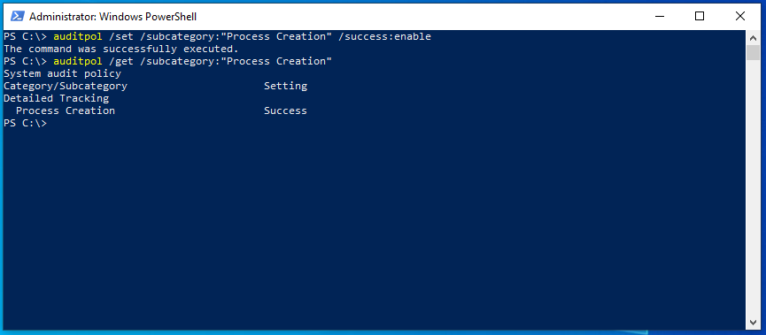
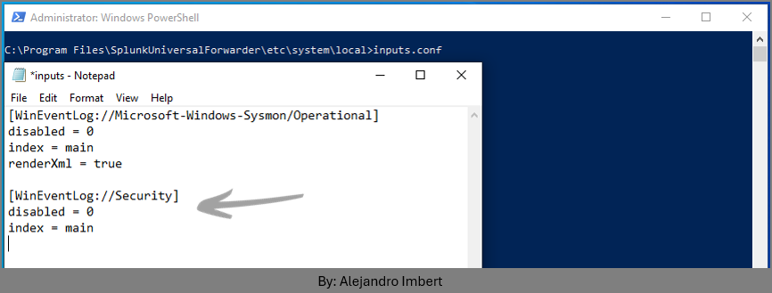
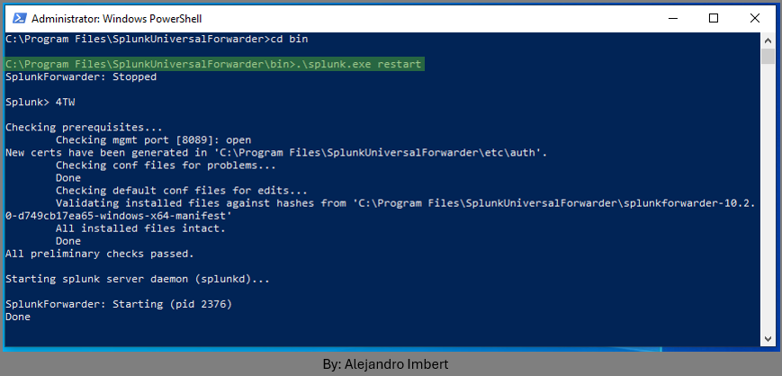
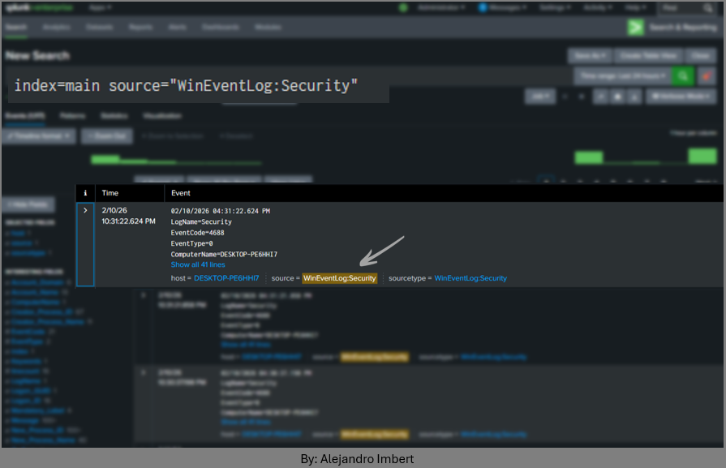
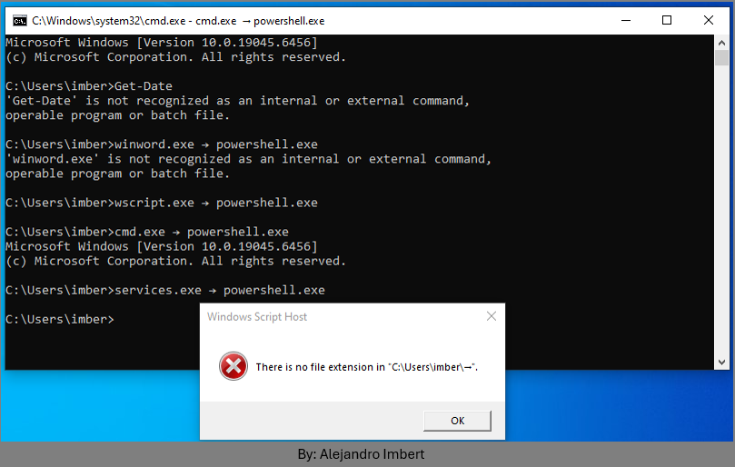
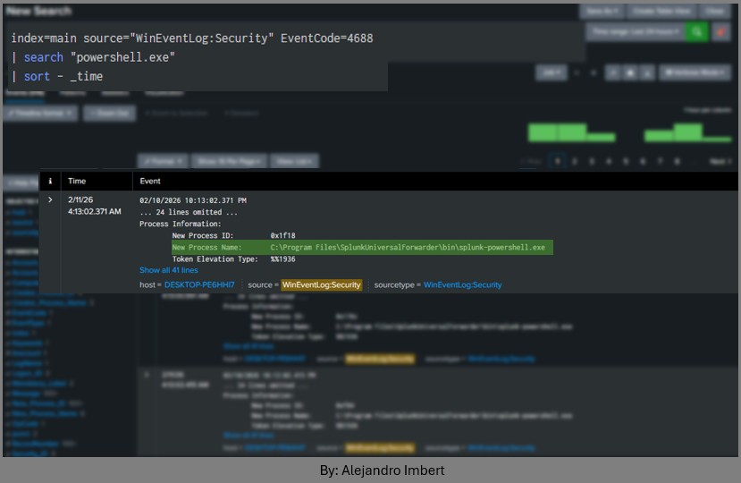
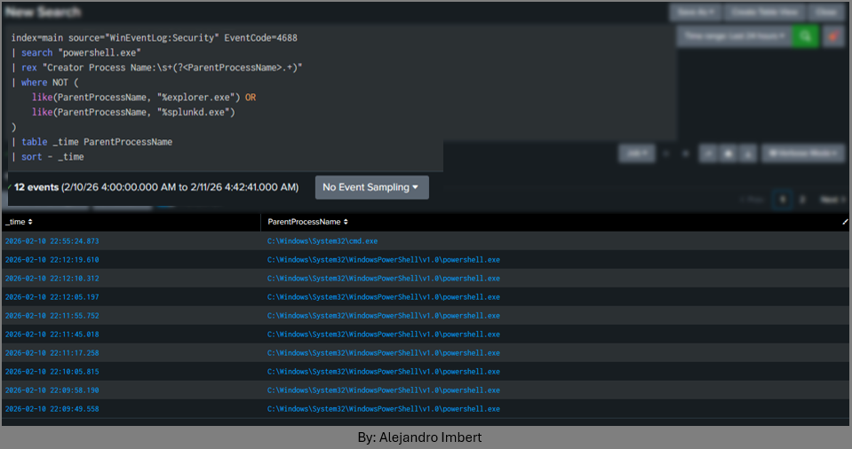
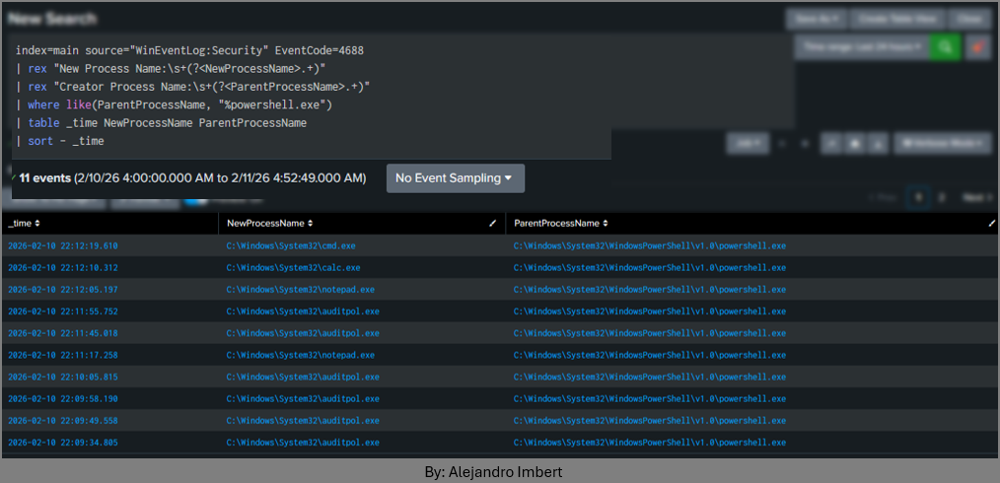
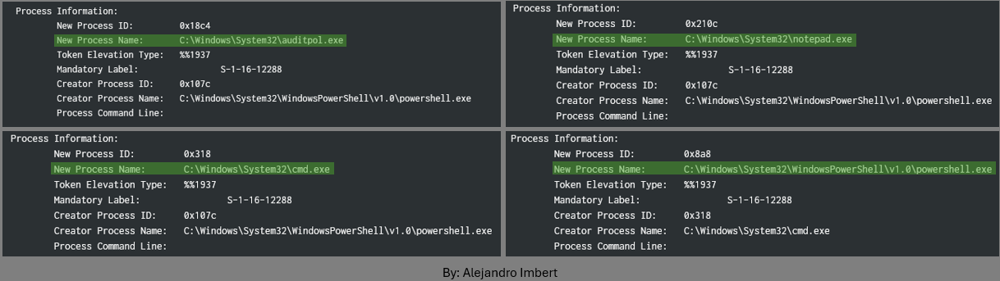

# Windows Security Log Enablement & First Process Creation Detection

## Context

After validating Sysmon ingestion and forwarder connectivity, attention shifted toward native Windows Security logs to ensure process creation visibility independent of Sysmon.

The goal of this phase was:

- Enable detailed process auditing.
- Ingest Security logs into Splunk.
- Validate `EventCode 4688` (Process Creation).
- Develop a first behavioral detection involving **PowerShell process spawning**.

This phase marked the transition from infrastructure setup to actual detection engineering.

## 1. Enabling Process Creation Auditing (auditpol)

To ensure Windows generated process creation events, auditing was explicitly enabled using `auditpol`.

Commands executed on the Windows VM:

```powershell
auditpol /set /subcategory:"Process Creation" /success:enable
auditpol /get /subcategory:"Process Creation"
```



This ensured that Windows logs `EventCode=4688` whenever a new process is created.

## Learning Outcome

- Windows does not always log detailed process creation events by default.
- `auditpol` directly controls auditing behavior.
- Visibility must be intentionally enabled before detection is possible.

## 2. Updating inputs.conf to Ingest Security Logs

To ingest Windows Security logs into Splunk, the following stanza was added to:

`C:\Program Files\SplunkUniversalForwarder\etc\system\local\inputs.conf`

```conf
[WinEventLog://Security]
disabled = 0
index = main
```



After modifying the file:

`.\splunk.exe restart`



Validation in Splunk:

```spl
index=main source="WinEventLog:Security"
```

Events were successfully indexed, confirming:

- Forwarder ingestion working.
- Security log access permitted.
- Splunk indexing functioning correctly.



Learning Outcome

- Sysmon is not strictly required for process visibility.
- Native Security logs provide valuable telemetry.
- Proper ingestion configuration is critical.

## 3. Generating Process Activity for Testing

To generate controlled telemetry, several applications were manually executed:

- `notepad.exe`
- `calc.exe`
- `cmd.exe`
- `wscript.exe`
- `winword.exe`



To view process creation events:

```spl
index=main source="WinEventLog:Security" EventCode=4688
| search "powershell.exe"
| sort - _time
```



### What is `EventCode 4688`?

`EventCode 4688` corresponds to: *“A new process has been created.”*

This event includes:

- New Process Name
- Creator Process Name
- Account Name
- Command Line (if enabled)
- Elevation type

This is one of the most important events for endpoint detection.

### SPL Explanation

- `index=main` → search within the main index.
- `source="WinEventLog:Security"` → restrict to Windows Security logs.
- `EventCode=4688` → filter process creation events.
- `search "powershell.exe"` → keyword match.
- `sort - _time` → newest events first.

### Learning Outcome

- Time range selection directly impacts visibility.
- Process creation logs provide parent-child relationships.
- Baseline behavior must be understood before identifying anomalies.

## 4. First Behavioral Filtering – Parent Process Analysis

With assistance from AI to refine SPL syntax, parent process filtering was introduced:

```spl
index=main source="WinEventLog:Security" EventCode=4688
| search "powershell.exe"
| rex "Creator Process Name:\s+(?<ParentProcessName>.+)"
| where NOT (
    like(ParentProcessName, "%explorer.exe") OR
    like(ParentProcessName, "%splunkd.exe")
)
| table _time ParentProcessName
| sort - _time
```



### SPL Explanation

- `rex` → extracts fields using regex from raw event text.
- `Creator Process Name` → extracted as ParentProcessName.
- `where NOT (...)` → excludes known benign parents.
- `table` → displays selected fields only.

This allowed filtering out:

- `explorer.exe` (normal interactive usage).
- `splunkd.exe` (internal Splunk activity).

### Learning Outcome

- Raw Windows events require field extraction.
- Regex-based field extraction enables flexible filtering.
- Baseline exclusion reduces noise significantly.
- Detection engineering often involves iterative refinement.

## 5. Improved Detection – Parent/Child Process Mapping

A more structured query was later implemented:

```spl
index=main source="WinEventLog:Security" EventCode=4688
| rex "New Process Name:\s+(?<NewProcessName>.+)"
| rex "Creator Process Name:\s+(?<ParentProcessName>.+)"
| where like(ParentProcessName, "%powershell.exe")
| table _time NewProcessName ParentProcessName
| sort - _time

```



### SPL Explanation

- Extracts both:
  - `NewProcessName`
  - `ParentProcessName`
- Filters for processes launched by PowerShell.
- Displays clear parent-child relationship.

This enabled detection of:

`powershell.exe → auditpol.exe`

Which can indicate audit policy modification activity.



### Learning Outcome

- Parent-child process relationships are foundational in detection engineering.
- PowerShell as a parent process deserves scrutiny.
- Regex extraction is powerful but requires understanding of event structure.
- AI assistance accelerated SPL refinement, but validation and interpretation remained manual.

## Key Takeaways from This Phase

- Native Windows Security logs provide strong process visibility.
- `EventCode 4688` is critical for SOC detection workflows.
- Time range awareness is essential during investigations.
- Detection building is iterative.
- Baseline understanding prevents false positives.
- Field extraction skills are foundational in Splunk.

## Lab Progression Status

At this stage:

- Logging pipeline validated.
- Security log ingestion operational.
- Process creation visibility confirmed.
- First behavioral detection implemented.
- Parent-child process analysis established.

The lab has officially transitioned from infrastructure setup into active detection engineering.
